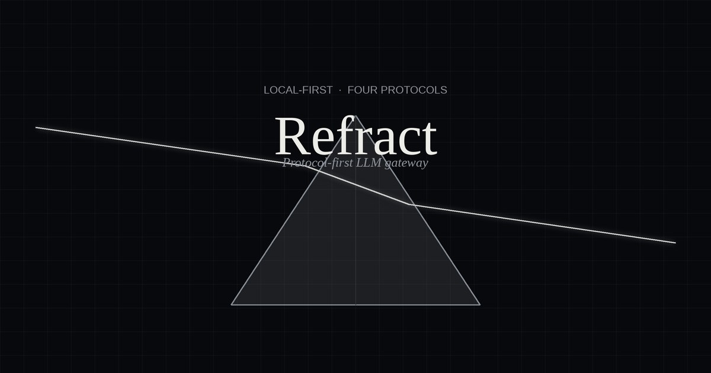

# Refract

**A protocol-first LLM aggregation API gateway.** A request enters as one protocol and exits as another — the four mainstream LLM protocols work interchangeably as both entry and exit, and upstream channels are modeled by protocol rather than by vendor.

English · [简体中文](./README.zh-Hans.md)



## Why not new-api

new-api models channel types as a flat enum: OpenAI, Anthropic, Gemini, every cloud vendor, every relay site… each new upstream adds one enum value and one adapter. Channel type equals vendor, so a single relay that speaks two protocols needs two channels, and protocol translation logic is scattered across if/else branches in the relay layer.

Refract's model is: **channel type = protocol**. There are only five:

| Kind | Meaning |
|---|---|
| `chat` | OpenAI Chat Completions (`/v1/chat/completions`) |
| `responses` | OpenAI Responses API (`/v1/responses`) |
| `messages` | Anthropic Messages (`/v1/messages`) |
| `gemini` | Google Gemini (`/v1beta/models/{model}:generateContent`) |
| `aggregate` | Aggregate channel: mounts 1–4 protocol endpoints in one channel |

Aggregate channels can express things new-api cannot: *"My relay offers both OpenAI and Anthropic protocols; the Anthropic line uses a different domain and a different key; claude models should always hit the native Anthropic endpoint first."*

## Core features

- **Protocol transcoding**: all four protocols convert through a unified IR (hub-and-spoke, not pairwise). Native requests only decode the `model`/`stream` routing fields; the full IR is built only for transcoding. With no alias or parameter override, request, response, and SSE bytes pass through unchanged. Each endpoint explicitly declares accepted inbound protocols. Transcoding is lossy for Anthropic block-level `cache_control` (same-protocol passthrough keeps it) and does not preserve `logprobs`.
- **Flexible address construction**: each channel/endpoint can toggle "unofficial address" (custom base URL + version prefix + path, joined in three segments) and "full address" (the final URL is used verbatim — no joining, no validation).
- **Per-endpoint configuration**: each protocol endpoint of an aggregate channel has its own address, credential, model set (with `alias=upstream_name` mapping), transcode policy, and priority order.
- **Native-first routing**: a global switch. Off: routing semantics match new-api (pure priority). On: native protocol endpoints always outrank transcoded ones.
- **Circuit breaking & health**: endpoints that fail consecutively are suspended with exponential backoff; upstream `Retry-After` headers are honored. State survives restarts and can be reset manually from the UI. Threshold and cooldown windows are configurable at runtime from Settings (threshold 0 disables the breaker).
- **Request logs**: inbound/upstream protocol, transcoding, chosen channel, retries, TTFB and token usage all persisted, with per-model aggregation (including average TTFB / duration and generation speed) and per-key aggregation; request and response body snapshots are captured by default (64 KB cap, streaming stores the aggregated text, can be disabled in Settings) and the logs page can show the full request. Retention defaults to 30 days, adjustable 1–3650. Every response carries an `x-refract-request-id` header matching its log row.
- **HTTP semantic passthrough**: native successes preserve the upstream status and end-to-end response headers while filtering hop-by-hop headers and stale streaming `Content-Length` values. A whitelist of client headers (`anthropic-beta`, `anthropic-version`, `openai-beta`, `x-title`, `http-referer`) is forwarded on native calls — never on transcoded ones.
- **Soft quotas and rate limits per key**: each gateway API key can carry a total token quota (rejected at authentication once exhausted) plus RPM/TPM per-minute limits (429 with `Retry-After` when exceeded).
- **Model pricing & spend tracking**: maintain a per-million-token price table in Settings (exact names or prefix wildcards); each request's cost is frozen into its log row using the table in effect at write time, and the dashboard, per-model and per-key stats all include spend.
- **Playground**: the admin UI ships a built-in playground that streams through the full gateway pipeline (routing, transcoding, breakers, logging) — no gateway key needed.
- **Unattended recovery**: terminal authentication failures can auto-disable a channel, periodic retests bring it back after recovery, and deduplicated webhook events report suspension, recovery, and auto-disable transitions.
- **Abnormal-200 handling**: retry fast HTTP 200 responses that contain no model output (default: within 3 seconds, up to 5 retries), with per-channel overrides; optionally turn plain text, HTML, unknown JSON/SSE, and other protocol-invalid 200 responses into explicit HTTP 500 errors.
- **Channel ledger**: refresh relay balances, compare request volume / latency / spend by channel, and inspect hourly or daily time series from the dashboard.
- **Operational probes & metrics**: public `/health/live`, `/health/ready`; Prometheus text-format `/metrics` requires the management token when one is configured.
- **Configuration and database backup**: export/import channels, gateway keys and settings as one JSON document; restored keys keep working across instances. Merge and replace import modes. Settings also exposes database size statistics and an online SQLite backup.
- **Single-binary deployment**: the built frontend is embedded into the binary; deploying is copying one file.
- **Designed for one user, not hard-wired to one user**: every business table carries `owner_id`, authentication is a trait — adding multi-user later doesn't touch business logic. Out of scope on purpose: multi-user accounts, payments, vendor-specific channel enums, Redis/multi-instance coordination, OpenAI files/batches/assistants, and a public homepage login.

## Quick start

Building requires Rust (2024-edition toolchain) and Node.js (pnpm):

```sh
# 1. Install the shared pnpm workspace and build the embedded admin UI
pnpm install
pnpm --filter @refract/admin build

# 2. Build the standalone public homepage when deploying it separately
pnpm --filter @refract/homepage build

# 3. Build and run the gateway
cargo run --release -p refract-server
```

Open http://127.0.0.1:3939 to reach the admin UI. After configuring a channel, point your clients at the gateway:

```sh
curl http://127.0.0.1:3939/v1/chat/completions \
  -H "Content-Type: application/json" \
  -d '{"model": "your-model", "messages": [{"role": "user", "content": "hello"}]}'
```

The same model is reachable through other protocols too (as long as the serving endpoint has transcoding enabled for them):

```sh
# Anthropic Messages shape → gateway → Chat upstream
curl http://127.0.0.1:3939/v1/messages \
  -H "Content-Type: application/json" \
  -d '{"model": "your-model", "max_tokens": 256, "messages": [{"role": "user", "content": "hello"}]}'
```

Or run the production container with Compose:

```sh
cp .env.example .env
# Replace REFRACT_ADMIN_TOKEN in .env
docker compose up -d --build
curl --fail http://127.0.0.1:3939/health/ready
```

Compose binds the host port to loopback only, runs as a non-root user with a read-only root filesystem, and stores SQLite in a named volume. See [`docs/OPERATIONS.md`](./docs/OPERATIONS.md) for backup, restore, and upgrade procedures.

## Gateway endpoints

| Endpoint | Protocol |
|---|---|
| `POST /v1/chat/completions` | OpenAI Chat Completions |
| `POST /v1/completions` | Legacy OpenAI Completions / FIM passthrough |
| `POST /v1/responses` | OpenAI Responses |
| `POST /v1/messages` | Anthropic Messages |
| `POST /v1beta/models/{model}:generateContent` | Gemini (`...:streamGenerateContent` for streaming) |
| `POST /v1beta/models/{model}:embedContent` · `:batchEmbedContents` | Gemini native embeddings (passthrough) |
| `POST /v1/embeddings` | OpenAI Embeddings (passthrough) |
| `POST /v1/images/generations` · `/v1/images/edits` | OpenAI Images (passthrough; edits is multipart) |
| `POST /v1/audio/speech` · `/v1/audio/transcriptions` · `/v1/audio/translations` | OpenAI Audio (passthrough; STT is multipart) |
| `POST /v1/moderations` | OpenAI Moderations (passthrough) |
| `POST /v1/rerank` | Cohere/Jina-shaped rerank (passthrough) |
| `POST /v1/messages/count_tokens` | Anthropic token counting (passthrough to messages endpoints) |
| `POST /v1beta/models/{model}:countTokens` | Gemini token counting (passthrough to gemini endpoints) |
| `GET /v1/models` · `/v1/models/{id}` · `/v1beta/models` · `/v1beta/models/{id}` | OpenAI and Gemini model discovery (derived from enabled channels) |
| `GET /v1/realtime?model=...` (WebSocket) | OpenAI Realtime native WebSocket bridge |
| `GET /metrics` | Prometheus metrics (management-token protected when configured; health probes stay public) |

Both streaming and non-streaming are supported. Gateway endpoints send permissive CORS headers so browser-based clients can call them directly. The admin UI lives under `/api/...`, uses a separate credential system from the gateway endpoints, and deliberately sends **no** CORS headers — the management surface is same-origin only.

Passthrough endpoints (embeddings, images, audio, moderations, rerank, token counting) have no cross-protocol translation, so each routes only to native endpoints of its own protocol: add the model to that endpoint's model list and it becomes routable. Aliases (the `model` field inside multipart forms is rewritten too), retries and circuit breaking behave exactly like chat traffic; `model` is the routing key and is required on every passthrough request.

Realtime is likewise native-only: it selects a healthy Chat endpoint, applies model aliases and gateway/key admission controls, then bridges text, binary, ping/pong and close frames without decoding events. Authenticate with `Authorization: Bearer <gateway-key>`; browser clients may use the OpenAI-compatible `realtime, openai-insecure-api-key.<gateway-key>` subprotocol pair (or `?key=`). A custom full Chat address must end in `/chat/completions` or `/realtime` so the WebSocket target can be derived without guessing.

## Configuration

`refract.toml` in the working directory (see [`refract.toml.example`](./refract.toml.example)); `REFRACT_*` environment variables take precedence:

| Key | Default | Meaning |
|---|---|---|
| `listen` | `127.0.0.1:3939` | Listen address. Localhost-only by default |
| `database` | `refract.db` | SQLite file path |
| `require_auth` | `false` | Whether gateway endpoints require an API key |
| `admin_token` | none | Set or rotate the admin token at startup; inject it with `REFRACT_ADMIN_TOKEN` |
| `upstream_timeout_secs` | `300` | Overall upstream request timeout (non-streaming) |
| `stream_idle_timeout_secs` | `120` | Streaming: max wait for response headers, then max gap between frames |
| `shutdown_grace_secs` | `30` | Graceful shutdown window before in-flight connections are aborted |
| `proxy` | none | Outbound proxy (http/socks5) |
| `master_key` | none | Master encryption key for credentials at rest (32-byte base64); inject via `REFRACT_MASTER_KEY` |


Routing policy (`max_attempts`, `max_upstream_calls`, native-first, selection) is runtime-tunable in the admin UI, not a `refract.toml` key.

**Security note**: the service refuses a non-loopback listener unless an admin token is configured and `require_auth=true`. `REFRACT_ADMIN_TOKEN` declaratively sets that token on every start; never commit its plaintext value.

## Development

One command starts both halves with hot reload (requires [`cargo-watch`](https://github.com/watchexec/cargo-watch): `cargo install cargo-watch`):

```sh
pnpm install   # first time only
pnpm dev
```

- Backend on `127.0.0.1:3939` — recompiles and restarts on Rust/SQL changes.
- Admin on `localhost:5173` — Vite HMR, with `/api`, `/v1`, `/v1beta`, `/health` and `/metrics` proxied to the backend. Open this one in the browser.
- Homepage on `localhost:3940` — start it separately with `pnpm dev:homepage`; it builds to `apps/homepage/dist` and is not embedded into the gateway.

Commit gating is handled by [lefthook](https://lefthook.dev) (installed into `.git/hooks` automatically by `pnpm install`): every `git commit` runs a privacy scan (real emails / API keys / machine paths, see `scripts/privacy-check.sh`), Vite Plus formatting and checks for both apps and the shared contracts package, and the Rust quality gate (`clippy -D warnings`). For intentional demo values, mark the line with a `privacy-allow` comment.

Full regression (hooks skip tests; run manually before releasing):

```sh
cargo test --workspace --all-targets --all-features --locked
pnpm --filter @refract/admin test:unit
pnpm --filter @refract/admin build
pnpm --filter @refract/admin test:e2e  # full flows against the real server binary
pnpm --filter @refract/homepage check
pnpm --filter @refract/homepage build
```

Architecture details in [`docs/ARCHITECTURE.md`](./docs/ARCHITECTURE.md); implementation rationale in [`docs/research/FOUNDATIONS.md`](./docs/research/FOUNDATIONS.md).

## License

[AGPL-3.0-only](./LICENSE). You are free to use and modify it; if you modify it and offer it to others as a network service, you must release your modifications under the same license.
